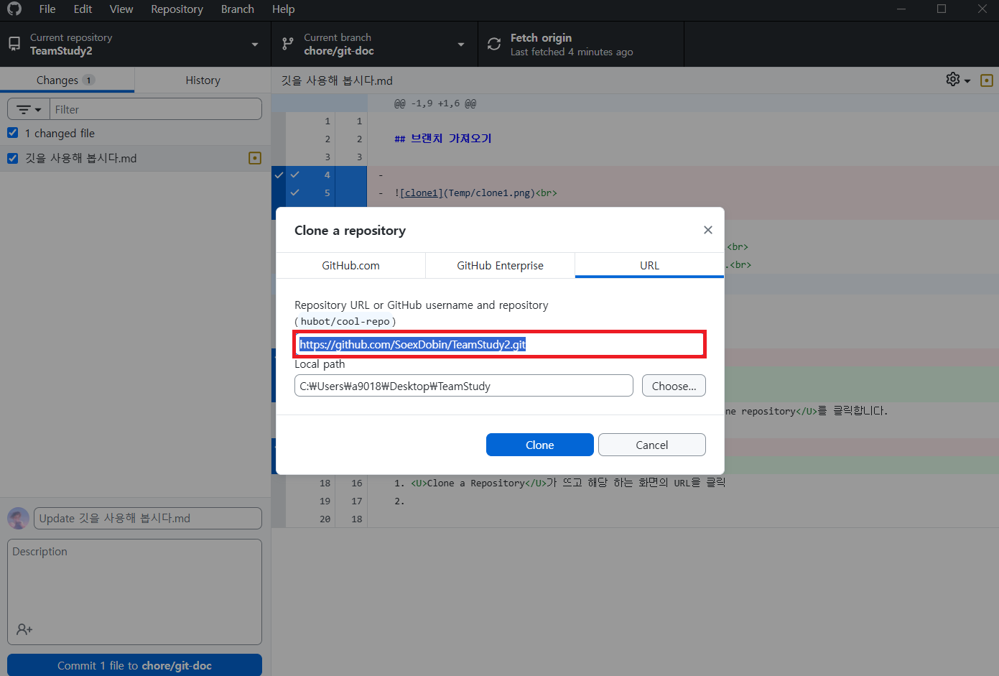
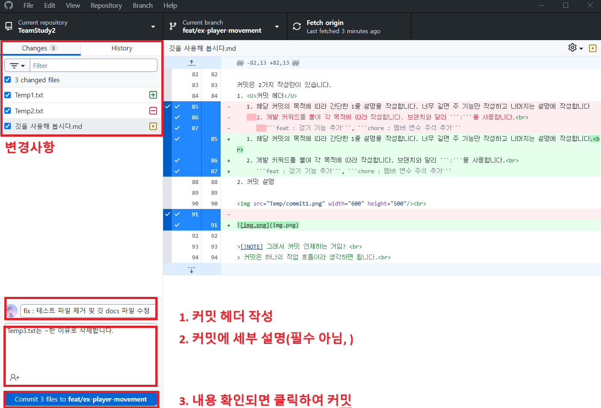
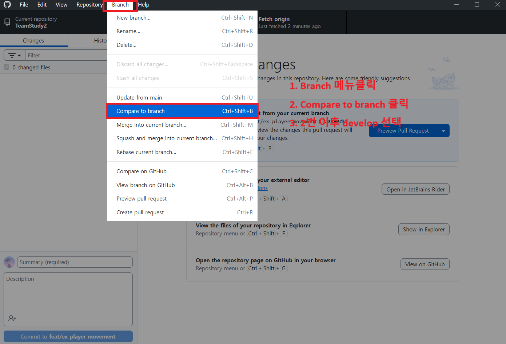
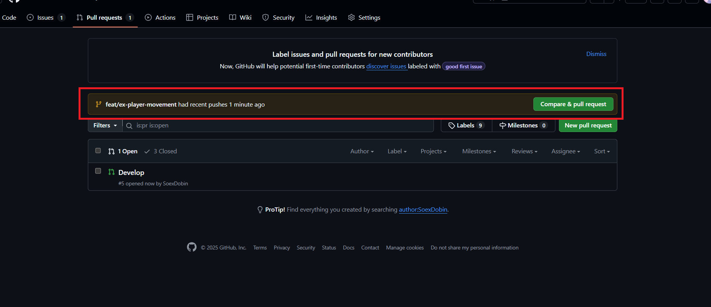

## 브랜치 가져오기

> [!NOTE]<br>
>개인&팀이 협업하는 환경을 모아두는 곳을 <U>Repository(저장소)</U>라고 합니다.<br> 
>타 저장소를 내 저장소로 가져오는 과정을 <U>Clone</U>이라 합니다.<br>

먼저 협업할 저장소의 <U>URL주소</U>를 웹에서 가져옵니다.<br>


### 깃 허브 데스크탑에서 저장소 복사하기
타 브랜치를 가져오려면 깃허브 데스크탑 상단UI에서 <U>File -> Clone repository</U>를 클릭합니다.
<br>
<br>

<br><br>
1. <U>"Clone a Repository"</U>라는 UI가 뜨고 해당 하는 화면의 URL을 클릭
2. 웹에서 복사해온 <U>깃 저장소의 주소</U>를 복사 붙여넣기 해줍니다.<br>
<br>
<br><br>
<br>
<U> .git </U> 파일과 함께 main환경과 똑같이 파일이 가져와지면 성공.
> [!NOTE]<br>
> .git 파일이 보이지 않는다면 "숨긴 폴더 해제"를 눌러주면 됩니다. 

<br><br>

## 브랜치 구성
1. main branch
   1. 메인 브랜치는 프로젝트가 실질적으로 완료 시점인 Release버전 exe가 올라갈때 사용합니다.
   2. <U>즉 프로젝트 완료 시점까지 저기로 갈 이유도 사용할 상황도 없습니다!!</U> 
2. develop branch
   1. 개발 과정에서 모든 코드가 집합하는 실 개발환경입니다.
   2. 대부분의 파생 브랜치는 develop을 통해 만들고, 또 모든 사항은 develop으로 합쳐집니다.
3. 여러분이 만들 브랜치 (ex. feat/player, bug/monster-collision)
   1. 당연하게도 여러분이 만들어 사용할 브랜치입니다.
<br><br><br><br><br>

>[!NOTE]
> 들어가기전 키워드 정리<br>
> <U>Local(로컬)</U> 내 컴퓨터에 클론해온 .git이 든 파일을 말합니다.   
> <U>Origin(오리진)</U> 실질적 깃 저장소. Origin에 올라와야 파일을 타인과 공유가 가능합니다.<br>
> push(다른 브랜치로 내 브랜치 정보를 전달합니다.), pull(다른 브랜치에서 내 브랜치로 정보를 가져옵니다.)

## 새로운 브랜치 생성 (깃허브 테스크 탑을 이용)
내가 생성할 브랜치의 토대를 정해야 합니다. 먼저 우리는 <U>현재 브랜치 위치</U>를 확인합니다.<br>
생성할 브랜치의 토대가 main이나 올바른 브랜치가 아닌지 확인해야 합니다.
<br>(지금은 **develop**으로 **고정**합니다. 상황따라 팀원들이 리드해주세요.)<br>

1. Current Branch에 UI를 통해 명시된 **develop**브랜치가 맞는지 확인 
2. 최신 develop을 가져오기 위해 ***항상!*** ***Fetch Origin***을 눌러줍니다.  
<br>
<br>
<br><br>

1. 상단 메뉴바에서 <U>Branch</U> -> <U>New Branch 클릭</U> 

<br>


2. <U>브랜치 이름 지정</U> -> <U>토대(base) 브랜치 develop 체크</U> -> <U>Create 클릭</U><br>
<br>

>[!NOTE] 브랜치 이름 접두사 & 커밋 키워드 정리<br>
> 용도와 목적에 따라 작성하시면 됩니다. 이름은 잘 지으면 있어보입니다.<br>
> ```feat/...``` 개발 코드, 기능&로직 추가시 사용합니다.<br>
> ```bug/...``` 컴파일 에러, 메모리 누수, 예상한 기능이랑 다르게 돌아감<br>
> ```fix/...``` 기능&로직은 같지만 코드 수정이 필요할 때<br>
> ```chore/...``` (chore == "허드렛일") 위 사항에 해당하지 않는 잡다한 작업<br>
> ```refactor/...``` 완료된 코드를 최적화 과정에서 더 좋은 로직으로의 수정시 사용합니다.(위에거 쓰시면 됩니다.)<br>
> [약속] 브랜치 이름은 소문자로 작성합니다. 띄어쓰기가 필요하다면 ```-```를 붙입니다.  
> 예시 : 플레이어 움직임 코드 구현 ```feat/ex-player-movement```

<br>
마지막으로 <U>Publish Branch</U>를 통해 Origin에 브랜치가 만들었다는 것을 알리면 완료입니다.<br>
<br>

## Commit 커밋 (윈도우 데스크탑 사용)
여러분이 작업을 하시면 <U>Changes</U>에 변경 사항이 띄워 집니다.
1. 초록색 : 새로운 파일 생성
2. 노란색 : 파일 내용에 변경사항이 있음
3. 빨간색 : 파일 제거

<br>

커밋은 2가지 작성란이 있습니다.
1. <U>커밋 헤더</U>
   1. 해당 커밋의 목적에 따라 간단한 1줄 설명을 작성합니다. 너무 길면 주 기능만 작성하고 나머지는 설명에 작성합니다.<br>
   2. 개발 키워드를 붙여 각 목적에 따라 작성합니다. 브랜치와 달리 ```:```을 사용합니다.<br>
      ```feat : 걷기 기능 추가```, ```chore : 멤버 변수 주석 추가```
2. 커밋 설명 : 필요시 부가 설명을 작성합니다.
   

<br> 
<br>
<br><br>

*커밋 되돌리기* 
커밋을 잘못 작성했다! 되돌리고 싶다! 하면 방법이 있습니다.
1. <U>history</U>탭으로 이동해서  
2. 지우고 싶은 커밋을 되돌리고 싶은 커밋 우클릭 ```Undo Commit```을 클릭
3. Create Commit 누르기 이전에 상태로 복귀를 확인
<br>
<br>
<br><br>

>[!NOTE] 그래서 커밋 언제하는 거임? <br>
> 커밋은 하나의 작업 흐름이라 생각하면 됩니다.<br>
> 프로그래머 역량에 따라 짧고 빡빡하게, 혹은 큼직하게 요령것 하시면 됩니다.<br>
> 그래도면 기능(함수) 추가나 클래스 생성시 보통 1커밋 합니다.

## Push(윈도우 데스크탑 사용)
커밋은 Origin으로 Push 하기 전까지 내 컴퓨터에만 남아있습니다.  
즉 다른 브랜치에 영향을 주지 않습니다.<br>

이제 열심히 작성한 커밋들을 내 컴퓨터 local에서 깃 Origin으로 밀어서 내 브랜치를 최신화 해주어야 합니다.<br>
그래야 <U>타인과 코드공유가 가능</U>하고 <U>develop으로 전달</U>할 수 있습니다.
<br>

## Pull Develop(윈도우 데스크탑 사용)
작업중 develop에서 branch를 가져와 현재 브랜치에 적용시켜야할 경우가 생깁니다.
이때 Pull을 통해 develop의 내용을 가져오는 법을 알아 봅시다.

1. 현재 작업중이던 브랜치에 commit을 올려 <U>Changes</U>를 비웁니다.
2. develop 브랜치로 이동하여 ```Fetch origin```을 눌러줍니다.
   1. ```Fetch origin```탭에 pull 이라는 목록이 있다면 받아옵니다.<br>
   <br>
3. 다시 작업중이던 브랜치로 이동합니다.
4. 상단 <U>Branch</U> 메뉴에서 <U>Compare to branch</U>를 누릅니다.<br>
   <br>
5. develop 브랜치를 클릭합니다.
6. <U>Create a merge commit</U>를 클릭하여 develop브랜치 내용을 내 브랜치에 적용시킵니다.
   1. 이 과정에서 서로의 코드가 겹치면 ```conflict``` 충돌 상황이 일어 날수 있습니다.
   2. 6번에서 해당 상황이 발생하면 주변에 깃 할줄 아는 사람을 대리고 가십쇼.<br> 
   <br>
7. 위 과정이 끝나면 <U>commit</U>이 생깁니다. 해당 커밋을 올리고 <U>push origin</U>을 해주어야 마무리 됩니다.


## Pull Request(내 브랜치를 develop으로)
내 브랜치의 작업 내용을 develop에 적용시키는 과정입니다. <U>제일</U> 중요합니다. 
1. 마무리를 위해 commit을 비우고 ```Fetch origin```으로 내 브랜치 local과 origin을 최신화 합니다.
2. 위 <U>Pull Develop</U> 과정을 한번 체크합니다.
3. 위 두 사항이 완료되면 내 브랜치에서 <U>Branch</U> -> <U>Create pull request</U><br>
   <br>
4. 이제 깃 저장소 웹사이트로 이동합니다. 
   1. pull request를 클릭합니다.
   2. compare & pull request<br>
   <br>
5. ***제일 중요!! 상단 pull 경로가 develop <- 내 브랜치 인지 확인!!!!***
   <br>
6. <U>Create pull request</U>를 눌러 pull request를 요청하면 마무리됩니다.

>[!NOTE]
> Merge는 각 팀원간 코드 리뷰를 통해서 무결성 검사후 진행합니다.  
 
